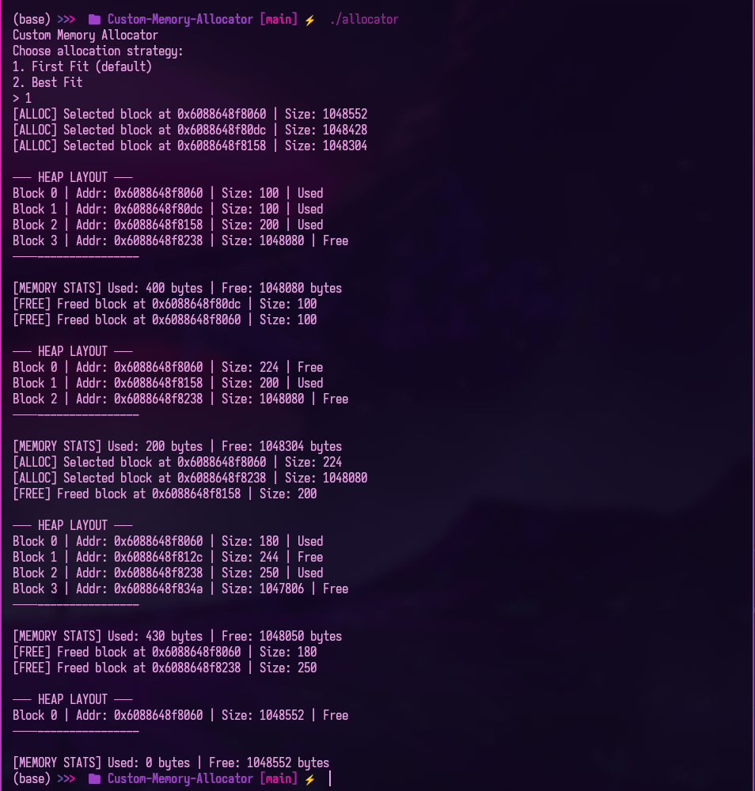

# Custom Memory Allocator in C

## Overview
This project implements a custom memory allocator in C, mimicking the functionality of `malloc`, `free`, `calloc`, and `realloc`. It's designed to simulate dynamic memory allocation using a fixed-size heap and linked list for memory block management — **no external libraries or OS-dependent memory functions used.**

## Features
- Manual `malloc`, `free`, `calloc`, `realloc` implementation
- First Fit and Best Fit allocation strategies (user selectable)
- Block splitting and coalescing
- Heap layout visualization with debug print
- Memory usage statistics (used vs free)
- Fully modular C code with header and source separation

## 📁 File Structure
```
.
├── allocator.h      # Public interface for allocator functions
├── allocator.c      # Core memory management logic
├── main.c           # CLI interface and test runner
├── README.md        # Project documentation
```

## How to Compile & Run
```bash
gcc main.c allocator.c -o allocator
./allocator
```

## Demo



## Topics Covered
- Low-level C programming
- Memory and pointer management
- Data structures (linked lists)
- Embedded system fundamentals
- Debugging and testing

---
Built with ❤️ by [Chaganti Reddy]

